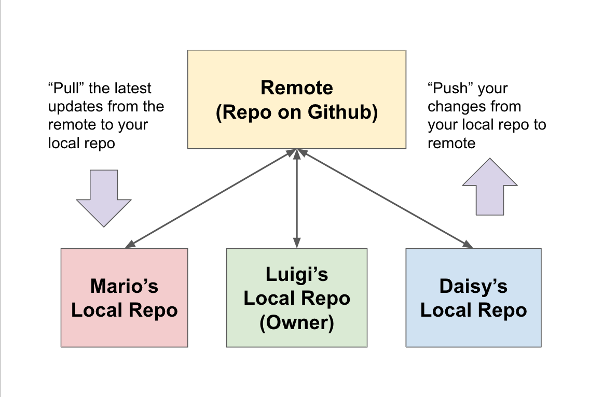
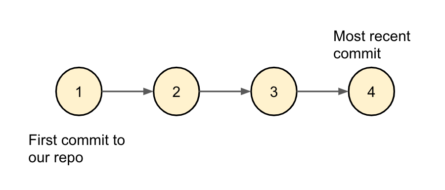

# Terminologies

Before we start using Git and Github, there are a couple of terminologies we first want to understand.

## What is a Repository?

When we refer to the term *repository*, we simply mean a single coding project. Usually, it's a single folder (what we call the *root directory* of the repository) that contains many code-related files and folders. For example, in a website project, you may have a few HTML files, a folder of CSS files, a folder of Javascript files and a folder of a few images. All of these combined create a single `repo` (short for repository).

## Remote vs. Local Repositories

In many modern applications, there's this concept of syncing your phone/computer to the cloud. For example, if you just took a photo on your iPhone / Android, there are applications now that will eventually sync this new photo to the cloud. That way, if your phone ever gets damaged, you won't lose it forever because it will be available online for you to redownload later.

Github works in a similar fashion. For a single Github repository, there are actually two copies. There's a *local* copy and a *remote* copy. The *remote* copy sits in the cloud and is managed by Github. The *local* copy is the repository that sits in your computer. When you coding a new feature, you'll most likely be working on your local copy. When you are finished with your feature, you can "upload" (what we call *push*) your new changes to the remote copy.

When it comes to collaborating with other coders, the remote copy on Github acts as the centralized source. While there is only one remote copy, there can be many local copies of the same repository - one for each teammate, each on their own respective computers. Anyone can push their new features to the remote and when they want the latest code from Github, they can "download" (what we call *pull*) new updates from Github into their local copies.



## What is a Git Commit?

Git does not automatically save local changes to the remote. As discussed earlier, you must manually push local changes to the remote in order for the repository on Github to be updated. We do this by creating a *commit* which is a snapshot of your local repository.

We'll show you how to create a commit later, but it's important to understand that **the central remote repository is simply the latest snapshot that's been pushed to the cloud**.

When you make changes to files on your local repo, create a commit, and push that commit, you are telling the remote repository to replace its current snapshot with your new incoming snapshot. Afterwards, when other team members pull new updates from Github, they'll be downloading this new snapshot (commit 4 from the diagram below) which contains your newest changes!



It's also important to note here that Git's history log simply contains a series of commits starting from the most recent commit. So a git log could look like below... Note the log starts from the most recent commit.

```git
commit 4
Author: Daphne <daphne@gmail.com>
Date:   Wed Apr 22 2020 15:23:56

    Fixed Typo in new feature ABC

commit 3
Author: Daphne <daphne@gmail.com>
Date:   Wed Apr 22 2020 15:23:56

    Add new feature ABC

commit 2
Author: Joe <joe@gmail.com>
Date:   Fri Mar 11 2020

    Changed color of header

commit 1
Author: Aaron <aaron@gmail.com>
Date:   Mon Jan 2 2020

    First Commit
```

---

[Continue](./02_branches.md)