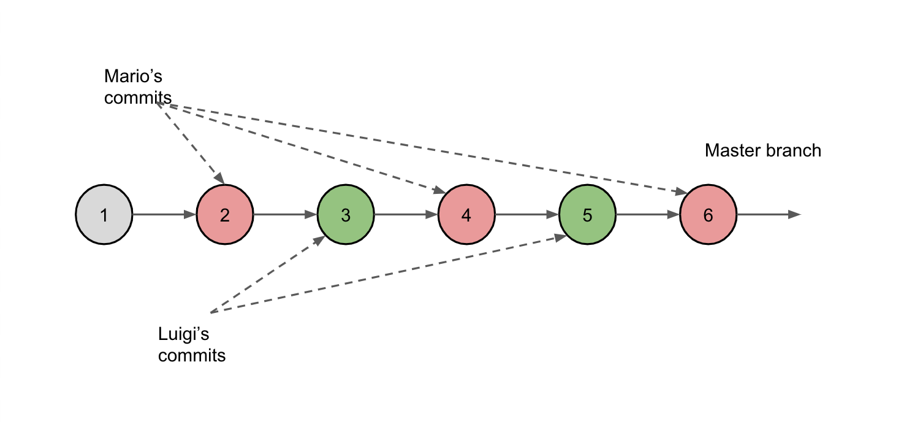
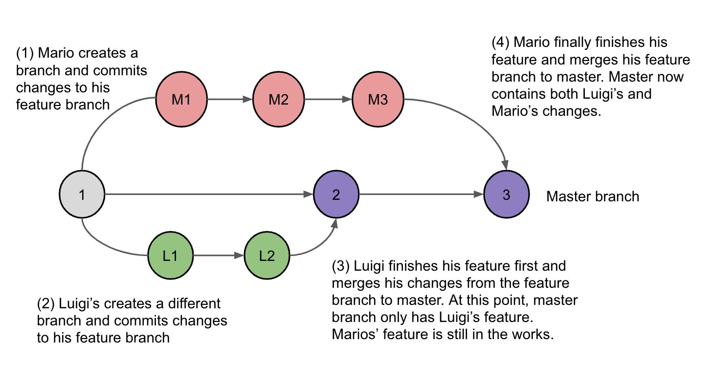

# What are Git Branches?

Please take a moment to view this video. You just need to watch the explanation of Git branches (up to 4:20). We'll get to the Github portal part later.

[Youtube link](http://www.youtube.com/watch?v=iJKIxrJ40ss)

In the example from the video, the owner created a shopping list app. But his friends were simultaneously editing the shopping list as well. When people collaborate on code like this, it can be scary because teammates may accidentally write over each other and cause each other's features to break.

## The Master Branch

Every repo has a `master` branch, which is the "default" branch. Ideally, the `master` branch should represent the latest, stable snapshot of the repository.

When people work on features, it usually takes multiple commits to complete their feature. If multiple teammates work off the `master` branch and are constantly pushing and pulling individual commits from each other, you can easily get into a messy state. In the below diagram, you'll see this single master branch is sprinkled with commits from both Mario & Luigi... but the problem is it's not clear when a particular feature is finished. There are certain versions in the master branch that may have unfinished features (commits 2-4).

## Feature Branching

Instead, we can use branching to keep features isolated. Branching allows users to "branch" off the repo and make commits at their own pace. If a user's work is branched off, he/she is not affected by other teammates. When the user is finished working on his/her feature, they may "merge" their changes back to the master branch.

This workflow is much more preferred than the former way because you won't be pulling someone else's half-finished feature and other people won't be messing with your half-finished feature. It's also very clear when master has a new completed feature (commits 2 and 3).

## Using Git Branches for multiple features

In the example provided above, we've discussed how to keep your feature isolated from your teammates. You can also use branching to help you manage multiple features that you are working on. Let's say two tasks are assigned to you that are unrelated to each other. I would recommend creating one feature branch for task A and creating another branch for task B. By doing things this way, you can keep the changes from accidentally affecting each other. With Git, it's actually very easy to switch in between branches!

In this scenario with a single user creating two feature tasks, the workflow would still look exactly like the above diagram (with Mario and Luigi on their own branches).

## Local Branches vs. Remote Branches

Remember local vs. remote repositories? The same concept also applies to branches. A remote branch is a branch that is managed by Github. For example, there will only be one remote `master` branch that is managed by Github.

Local branches are branches of repositories that exist on individual computers. For instance, there can be a local `master` branch on my computer and one local `master` branch on Luigi's computer. When you push commits from a local branch, you should be pushing to a remote branch that has the same name as your local branch (example: push from local `feature_x` to remote `feature_x`). We'll talk more about how to merge branches later, but for now, understand that just like there are local and remote repositories, there are also local and remote branches.

---

[Continue](./02_branches.md)