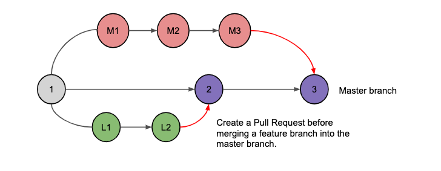
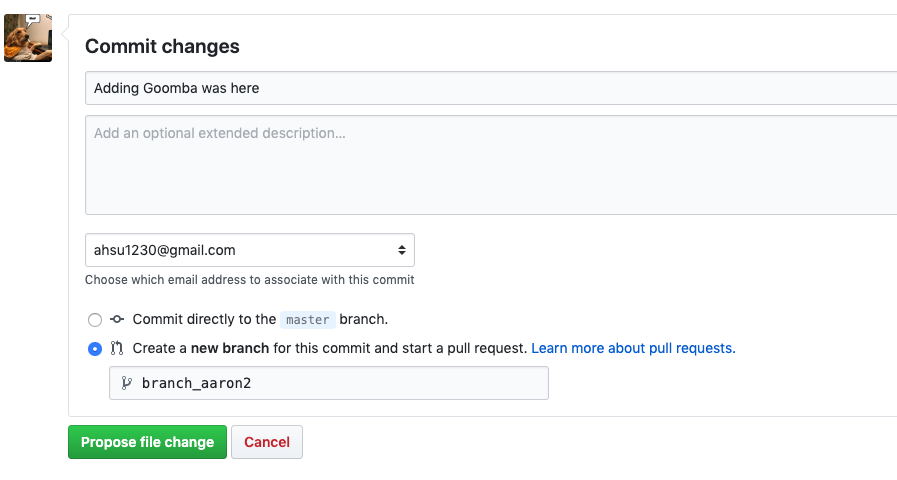
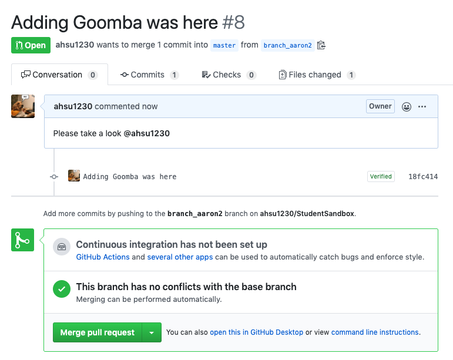
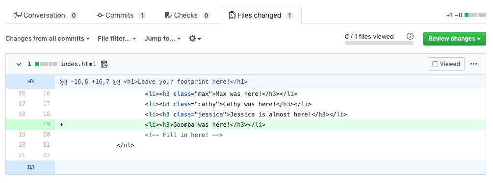

# The Github Portal

We'll start our first exercise and create your first Pull Request on Github!

## Videos

Take a moment to watch this series of videos. The speaker goes through how to use the fundamentals of creating a Pull Request all on the Github website

- [Repositories and Commits](https://www.youtube.com/watch?v=hMfi_ONvGEs&list=PLB5jA40tNf3v1wdyYfxQXgdjPgQvP7Xzg&index=2)
- [Git Branches](https://www.youtube.com/watch?v=iJKIxrJ40ss&list=PLB5jA40tNf3v1wdyYfxQXgdjPgQvP7Xzg&index=3)
- [Pull Requests](https://www.youtube.com/watch?v=nT8KGYVurIU&list=PLB5jA40tNf3v1wdyYfxQXgdjPgQvP7Xzg&index=4)

### What are Pull Requests for?

Collaborating with coders can be very tough, especially if you work with many people. The main purpose of a Pull Request is to give teammates a chance to view other people's code and give feedback BEFORE it gets merged into the `master` branch.

For instance, it's possible that a new feature might not be coded correctly. If we let that feature branch merge into master, it will break a lot of functionalities. When you create a Pull Request, you are "proposing" changes to the codebase and giving other coders a chance to review the changes and minimize risks. Remember this diagram? The Pull Request (in red) should always be created and approved by other coders before merging the feature branch to the master branch.



## Creating your first Pull Request

- Navigate to: <https://github.com/ahsu1230/StudentSandbox>
- Look for the `index.html` file in the root directory and click on it.
- Edit `index.html` and include this line with your name in it!

```html
<li><h3>YOUR_NAME was here!</h3></li>
```

- Once, you're done editing the file, you'll create a commit from it.
  - Fill in a message which summarizes what your commit does.
  - Select the SECOND option, *Create a new branch for this commit and start a pull request*
  - Name your branch `branch_YOUR_NAME` i.e. `branch_aaron`



- Click on **Propose File Change**
  - If you get an error here, it may mean you don't have write permissions to create a Pull Request. Please email Aaron with your Github username to request write permissions.
- Leave a comment and tag me `@ahsu1230` in the Pull Request description
- **Create Pull Request**
  - Do *NOT* merge the Pull Request yet. We'll be doing more stuff to it before we finally can merge it.



Go ahead and navigate to the *Files changed* tab. This tab shows which files have been changed in this Pull Request. You should see that only one file has changed and only one line of that file has changed.



---

[Continue](./04_intro_cli.md)
